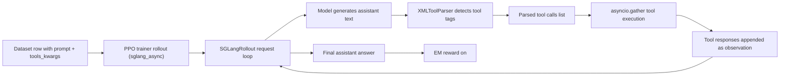
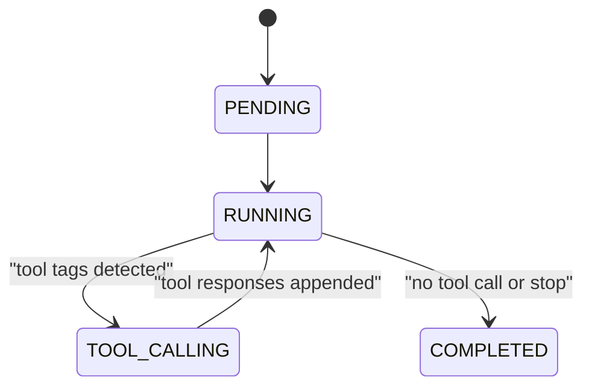

# GAP Planning Deep Dive (English)

## 1. Purpose and scope
This document is an engineering deep dive into how planning works in the GAP repository.

It covers two layers:
1. The planning paradigm described in the paper (Section 3).
2. The planning and execution behavior implemented in the public codebase.

The objective is practical clarity for contributors who need to:
- Understand how plans are represented.
- Understand how tool calls are parsed and executed.
- Understand how dependency handling works today.
- Identify gaps between paper-level algorithm and runtime-level implementation.
- Implement an explicit DAG scheduler if needed.

This is not a benchmark report. It is a systems and implementation document.

---

## 2. Ground truth sources used in this deep dive
Primary references in this repository:
- `Agent/data/mhqa_agent/sys_prompts.py`
- `Agent/data/mhqa_agent/prepare_data.py`
- `Agent/data/mhqa_agent/prepare.sh`
- `Agent/train/mhqa_agent/rl/train_dapo_mhqa_agent_wiki.sh`
- `Agent/train/mhqa_agent/rl/train_dapo_mhqa_agent_serper.sh`
- `Agent/evaluation/mhqa_agent/eval_mhqa_agent.sh`
- `verl/verl/tools/xml_tool_parser.py`
- `verl/verl/tools/schemas.py`
- `verl/verl/tools/base_tool.py`
- `verl/verl/tools/config/search_tool_config/wiki_rag_config.yaml`
- `verl/verl/tools/config/search_tool_config/training_servers_config.yaml`
- `verl/verl/workers/rollout/schemas.py`
- `verl/verl/workers/rollout/chat_scheduler.py`
- `verl/verl/workers/rollout/sglang_rollout/sglang_rollout.py`
- `verl/verl/trainer/config/ppo_trainer.yaml`
- `verl/verl/utils/reward_score/mhqa_train.py`
- `verl/verl/utils/reward_score/mhqa_eval.py`

Paper source reviewed:
- arXiv PDF: `GAP-2510.25320.pdf`, Section 3 and Algorithm 1.

---

## 3. Planning in one sentence
In the paper, planning is explicit graph construction plus dependency-aware scheduling.
In the code, planning is primarily an LLM behavior induced by prompts, and execution parallelism is achieved by parsing tool tags and running tool calls concurrently per turn.

---

## 4. Architecture map

### 4.1 End-to-end runtime chain



### 4.2 Control plane vs data plane
- Control plane:
  - Script and config selection (`tool_config_path`, `use_xml_tool_parser`, `max_turns`).
  - Prompt key selection (`MHQA_PROMPT`, `WEB_AGENT_PROMPT`).
- Data plane:
  - Model output text.
  - Tool-call parsing.
  - Tool execution.
  - Observation injection.
  - Next-step generation.

---

## 5. Paper-level planning model (Section 3)

### 5.1 Formal model
Paper defines:
- Query: `q`
- Tools: `T = {t1, ..., tn}`
- Subtasks: `S = {s1, ..., sm}`
- Dependency graph: `G = (V, E)` as a DAG.

Semantics:
- Vertex `vi` corresponds to subtask `si`.
- Edge `(vi, vj)` means `sj` depends on output of `si`.
- No edge means potential parallelism.

### 5.2 Decomposition steps
Section 3.2 defines:
1. Subtask identification.
2. Dependency analysis.
3. Graph construction.

The paper gives both adjacency-style and XML-like graph examples.

### 5.3 Scheduling semantics
Section 3.3 defines level-wise execution via topological sorting:
- Level `L0`: nodes with in-degree 0.
- Level `Li`: nodes whose dependencies are all in previous levels.
- Each level executes in parallel.
- Barrier between levels.

### 5.4 Algorithm 1 semantics
Algorithm 1 implies this explicit runtime process:
1. Generate plan.
2. Parse graph from plan (`ParseGraph`).
3. Build levels (`TopologicalSort`).
4. Execute level by level.
5. Synthesize final answer.

This is an explicit graph-orchestrated planner-runtime architecture.

---

## 6. Code-level planning model (public repository)

## 6.1 Prompt planning contracts

### 6.1.1 MHQA prompt family
In `Agent/data/mhqa_agent/sys_prompts.py`, multiple prompt variants define planning behavior.

Important variants:
- `MHQA_PROMPT`
- `MHQA_PROMPT_ONE_SHOT`
- `ENHANCED_MHQA_PROMPT`

`ENHANCED_MHQA_PROMPT` includes explicit dependency formatting rules:
- Task ID
- Description
- Dependencies
- Parallel execution indicated by `|` in `wiki_search`

Example style:
```xml
<plan>
T1: ...
- Dependencies: none
T2: ...
- Dependencies: T1
</plan>
<wiki_search>query_a|query_b</wiki_search>
```

### 6.1.2 AFM/Web prompt family
`Agent/data/sys_prompts.py` and related MHQA prompts define broader tool-integrated workflows (`think`, `plan`, `tool`, `reflection`, `answer`).

Key point: planning is instruction-driven and behavior-driven. There is no separate symbolic planner process in the runtime path.

### 6.1.3 Which prompt is actually used by default?
`Agent/data/mhqa_agent/prepare_data.py` maps:
- `SR1`
- `MHQA_PROMPT` -> `MHQA_PROMPT_ONE_SHOT`
- `WEB_AGENT_PROMPT`

Even though `ENHANCED_MHQA_PROMPT` is imported, it is not in `SYS_PROMPT_MAP` by default.

`Agent/data/mhqa_agent/prepare.sh` uses:
```bash
--sys-prompt-key MHQA_PROMPT
```

So default data preparation does not force the enhanced dependency format unless changed.

---

## 6.2 Tool capability surface constrains planning

Planning is conditioned by available tools loaded from `tool_config_path`.

### 6.2.1 Single-tool mode (wiki only)
`wiki_rag_config.yaml` defines only `wiki_search`.

Consequence:
- Planner can only call `wiki_search` in runtime.
- Parallel behavior, if any, is parallel `wiki_search` calls.

### 6.2.2 Multi-tool mode
`training_servers_config.yaml` typically exposes:
- `wiki_search` (mapped to web search backend)
- `crawl_page`

Consequence:
- Planner can choose between search and crawl patterns.
- Runtime still parses tool tags from generated text and executes calls accordingly.

### 6.2.3 Script wiring
Training/eval scripts set:
- `actor_rollout_ref.rollout.multi_turn.enable=true`
- `actor_rollout_ref.rollout.multi_turn.use_xml_tool_parser=true`
- `actor_rollout_ref.rollout.multi_turn.tool_config_path=...`

This turns on XML tag parsing path and tool execution loop.

---

## 6.3 Data object used by runtime
`AsyncRolloutRequest` (`verl/verl/workers/rollout/schemas.py`) is the core runtime container.

Key fields for planning/execution:
- `messages`: chat history with assistant and tool messages.
- `tool_schemas`: active tool schema set for this request.
- `tools_kwargs`: per-tool create/execute/calc_reward/release kwargs.
- `state`: `PENDING`, `RUNNING`, `TOOL_CALLING`, `COMPLETED`.
- `web_search_history`, `crawl_page_history`: duplicate-call guards.
- `tool_call_info`, `detailed_tool_metrics`: observability for tool usage.

This is where trajectory-level dependency context lives implicitly through message history.

---

## 6.4 Tool-call parser behavior

### 6.4.1 XMLToolParser scope
`verl/verl/tools/xml_tool_parser.py` creates regexes for tool tags based on loaded tool names.

Important constraints:
- Only tags matching active tool names are parsed.
- Unknown tags are ignored by this parser.

### 6.4.2 Parallel query expansion rule
Special handling for `wiki_search`:
- If content contains `|`, split into multiple queries.
- Each query becomes one `ParsedToolCall`.

Example:
```xml
<wiki_search>a|b|c</wiki_search>
```
becomes three calls.

### 6.4.3 Non-wiki tools
For non-`wiki_search` tags, parser creates one call with `{"query": <content>}`.

### 6.4.4 Parser does not parse plans
Current parser does not parse:
- `<plan>` structures
- dependency graph objects
- `<graph>` node/edge declarations

No graph IR is emitted by parser.

---

## 6.5 Runtime state machine (SGLang path)

Main loop in `sglang_rollout.py` uses a state machine:
- `PENDING` -> initialize tool instances
- `RUNNING` -> generate assistant output
- `TOOL_CALLING` -> execute parsed tool calls
- `COMPLETED` -> finalize trajectory



### 6.5.1 RUNNING state
- Model produces text.
- If parser detects tool tags, parse tool calls.
- Convert parsed calls into `OpenAIFunctionToolCall` objects.
- Transition to `TOOL_CALLING`.

### 6.5.2 TOOL_CALLING state
- Build an execution list for all parsed calls.
- Apply duplicate-call guard for repeated search/crawl queries.
- Execute calls concurrently using `asyncio.gather(...)`.
- Append tool outputs as tool messages.
- Transition back to `RUNNING`.

### 6.5.3 Turn barrier semantics
After each batch of tool calls in one turn, the loop waits for all results before next generation turn.
This is a per-turn barrier.

---

## 6.6 Dependency handling semantics in code

Dependency is currently handled in an implicit way:
- The model writes plans and decides what to call next.
- Runtime executes whatever valid tool calls are emitted.
- Observations are appended to context; future steps depend on this context.

What is missing for explicit dependency handling:
- No runtime DAG parse.
- No topological scheduling object.
- No static validation that all declared dependencies were satisfied.
- No hard check that parallelized tasks are truly independent.

Therefore the current system is best described as:
- Prompt-shaped dependency reasoning.
- Runtime concurrent tool execution within turn.
- Context-based dependency continuation across turns.

---

## 6.7 Error and guard behavior

### 6.7.1 Argument decode errors
`OpenAIFunctionCallSchema.from_openai_function_parsed_schema`:
- If JSON decode fails, tool args become `{}` and `has_decode_error=True`.
- Caller drops that tool call.

### 6.7.2 Empty parsed call list after detection
If parser says tool-like text exists but valid parsed calls are empty:
- Request is completed with stop reason.

### 6.7.3 Duplicate query guard
Repeated queries for web search/crawl receive canned responses to avoid redundant calls.

### 6.7.4 Resource/length guards
- `max_turns` guard.
- prompt/response max length guards.
- model max context guards.

### 6.7.5 Unknown tool names
Execution maps by `self._tool_map[tool_name]`.
If name is absent, runtime can error (KeyError path), so tool-schema alignment is critical.

---

## 6.8 Chat scheduler and tool schema injection

`ChatCompletionScheduler` (`chat_scheduler.py`) submits messages to OpenAI-compatible endpoints with:
- `tools=self.completion_callback.tool_schemas`
- callback recursion for multi-turn.

This means tool availability is not only prompt text but also API-level schema injection.

However, with XML parser mode in sglang rollout, parsing is still text-tag based.

---

## 6.9 Reward coupling to planning

Current MHQA reward path (`mhqa_train.py`, `mhqa_eval.py`):
- Extracts `<answer>...</answer>`.
- Applies EM-like correctness scoring.
- No direct reward for:
  - plan quality
  - dependency correctness
  - number of levels
  - parallelism efficiency
  - tool economy

Implication:
- Planning quality is optimized indirectly through final answer correctness and trajectory priors.

---

## 7. Paper vs code alignment matrix

| Dimension | Paper Section 3 | Public code today | Alignment |
|---|---|---|---|
| Planning representation | Explicit DAG | Prompt text + optional dependency phrasing | Partial |
| Graph parsing | `ParseGraph` step | No plan/graph parser in runtime | Missing |
| Scheduling | Topological levels | Per-turn parse then concurrent gather | Partial |
| Parallelization unit | Same-level graph nodes | Tool calls parsed in one turn | Partial |
| Dependency enforcement | Explicit by graph levels | Implicit via context and model behavior | Partial |
| Tool selection | per-node tool assignment | schema-constrained tool tags | Aligned in spirit |
| Runtime determinism | Graph-driven executor | generation-driven executor | Different |

Summary:
- The implementation captures the spirit of dependency-aware parallel behavior.
- It does not yet implement explicit graph-native scheduling described by Algorithm 1.

---

## 8. Deep call-graph walkthrough

This section traces one sample from dataset row to reward.

### 8.1 Dataset prep
`prepare_data.py` emits each sample with:
- `prompt`: user content including system prompt template.
- `extra_info.tools_kwargs`: active tools and kwargs.

### 8.2 Trainer rollout mode
Training scripts set:
- `rollout.name=sglang_async`
- `multi_turn.enable=true`
- XML tool parser enabled.

### 8.3 Request preprocessing
`_preprocess_prompt_to_async_rollout_requests`:
- Builds one `AsyncRolloutRequest` per rollout sample.
- Restricts tool schemas to keys in sample-level `tools_kwargs`.

### 8.4 Generation loop
`_async_rollout_a_request`:
- Generates assistant text.
- Parses tool tags if present.
- Executes tool calls in parallel.
- Injects tool observations.
- Repeats until stop or limit.

### 8.5 Finalization and reward
- Final answer stays in trajectory.
- Reward function extracts `<answer>` and computes EM score.
- Tool metrics are recorded but not directly part of reward in MHQA path.

---

## 9. Planning formats in practice

## 9.1 Human-readable plan format (used by prompts)
Examples follow this style:
```xml
<plan>
T1: gather entity A
- Dependencies: none
T2: gather entity B
- Dependencies: none
T3: compare A and B
- Dependencies: T1, T2
</plan>
```

Strength:
- Easy to produce and inspect.

Limitation:
- Not machine-validated by runtime today.

## 9.2 Tool-call format (machine-consumed)
Machine-consumed format is tag-based tool call text:
```xml
<wiki_search>query1|query2</wiki_search>
<crawl_page>https://example.com/a|https://example.com/b</crawl_page>
```

The parser transforms this into structured tool call objects.

---

## 10. What "dependency-aware" means in this implementation

In strict systems terms, there are two definitions:

1. **Explicit dependency-aware execution**
   - Dependency graph is a first-class runtime object.
   - Scheduler enforces dependency constraints.

2. **Implicit dependency-aware execution**
   - Model is instructed to reason about dependencies.
   - Runtime executes emitted calls and feeds observations back.
   - Dependency behavior emerges from trajectory quality.

Current GAP code is mostly category 2.

---

## 11. Proposed explicit DAG implementation blueprint

This section provides a concrete design to reach paper-style explicit scheduling.

## 11.1 Add a machine-readable graph IR
Add a plan IR block in assistant output:
```json
{
  "plan_version": "1.0",
  "nodes": [
    {
      "id": "T1",
      "tool": "wiki_search",
      "arguments": {"query": "capital of france"},
      "depends_on": []
    },
    {
      "id": "T2",
      "tool": "wiki_search",
      "arguments": {"query": "capital of germany"},
      "depends_on": []
    },
    {
      "id": "T3",
      "tool": "wiki_search",
      "arguments": {"query": "population of {T1}"},
      "depends_on": ["T1"]
    }
  ]
}
```

## 11.2 Parser module
Introduce a parser module with output type `PlanGraph`.

Validation checks:
- Unique node IDs.
- Tool name exists in active `tool_map`.
- Every `depends_on` exists.
- No cycles.
- Required arguments present by schema.

## 11.3 Scheduler module
Implement topological level partitioning (Kahn algorithm).

Execution semantics:
- For each level, resolve placeholders from dependency outputs.
- Execute all nodes in level with `asyncio.gather`.
- Persist node outputs into plan context.

## 11.4 Fallback path
If graph parsing fails:
- Fall back to current tag-driven execution mode.
- Emit parse diagnostics for analysis.

## 11.5 Minimal integration points
- `verl/verl/tools/xml_tool_parser.py` or new sibling parser module.
- `verl/verl/workers/rollout/sglang_rollout/sglang_rollout.py` request loop.
- Optional reward extension in `mhqa_train.py` for graph compliance/efficiency.

---

## 12. Suggested interfaces for explicit planner

### 12.1 Data classes
```python
@dataclass
class PlanNode:
    node_id: str
    tool: str
    arguments: dict
    depends_on: list[str]

@dataclass
class PlanGraph:
    nodes: dict[str, PlanNode]
```

### 12.2 Core APIs
```python
def parse_plan_graph(text: str) -> PlanGraph: ...
def validate_plan_graph(graph: PlanGraph, tool_map: dict) -> None: ...
def build_levels(graph: PlanGraph) -> list[list[str]]: ...
async def execute_level(level_nodes: list[PlanNode], ctx: dict) -> dict: ...
```

### 12.3 Runtime policy
- `mode=implicit`: existing behavior.
- `mode=explicit_graph`: graph parsing + scheduler.
- `mode=hybrid`: use explicit when parseable; fallback otherwise.

---

## 13. Testing strategy for planner correctness

## 13.1 Unit tests
1. Parser tests:
   - valid graph parsing.
   - malformed JSON.
   - unknown tool.
   - missing dependency node.
2. Graph tests:
   - cycle detection.
   - level partition correctness.
3. Placeholder substitution tests.

## 13.2 Integration tests
1. End-to-end run with explicit graph mode on simple synthetic tasks.
2. Compare output correctness against implicit mode.
3. Verify number of tool calls and execution order.

## 13.3 Regression tests
1. Existing MHQA scripts still run with implicit mode unchanged.
2. XML tag parser path remains backward compatible.

---

## 14. Observability recommendations

Track per-sample fields:
- `plan_parse_success`
- `plan_node_count`
- `plan_level_count`
- `plan_cycle_detected`
- `parallel_batches_executed`
- `avg_batch_width`
- `dependency_violation_count`
- `tool_call_count`
- `duplicate_call_block_count`

This makes planner behavior diagnosable beyond final EM.

---

## 15. Known limitations in current code path

1. Plan text is not semantically validated by runtime.
2. Dependency semantics are not hard-enforced.
3. Reward does not directly optimize plan quality or execution efficiency in MHQA path.
4. Prompt variants with explicit dependency formatting are not all wired by default.
5. Tool-level failures are mostly handled reactively per turn, not globally at graph level.

---

## 16. Practical contributor guidance

If you only need to improve answer quality:
- Tune prompt templates and retrieval behavior.
- Keep runtime unchanged.

If you need stronger dependency guarantees:
- Implement explicit graph IR parsing and scheduling.
- Add graph compliance metrics.

If you need production reliability:
- Add strict schema validation for tool arguments.
- Add robust failure policy per dependency level.

---

## 17. Migration plan from implicit to explicit graph scheduling

Phase 1: Instrumentation only
- Keep implicit runtime.
- Parse graph if present, but do not execute from it.
- Log graph diagnostics.

Phase 2: Shadow scheduling
- Build levels from parsed graph in shadow mode.
- Compare scheduled calls to actual emitted calls.

Phase 3: Hybrid execution
- Execute explicit graph when parse confidence is high.
- Fallback to implicit mode on parse failures.

Phase 4: Full explicit mode
- Require parseable graph IR for selected training subsets.
- Add reward terms for dependency correctness and efficient batching.

---

## 18. FAQ

### Q1: Is GAP in code truly graph-based today?
It is graph-inspired at the planning prompt level and concurrent at execution level, but not fully graph-native at runtime scheduling level.

### Q2: Does code use topological sort right now?
Not in the public runtime path reviewed here.

### Q3: Where is parallelism actually implemented?
In concurrent execution of parsed tool calls within a turn (`asyncio.gather`).

### Q4: Is there any dependency checker in runtime?
Not as an explicit graph checker. Dependency handling is primarily implicit through iterative context and model behavior.

### Q5: What enforces tool availability?
Tool schemas loaded from `tool_config_path` and parser/tool-map alignment.

---

## 19. Quick reference map

### 19.1 Prompt and data
- Prompt templates: `Agent/data/mhqa_agent/sys_prompts.py`
- Prompt key mapping: `Agent/data/mhqa_agent/prepare_data.py`
- Sample tools kwargs creation: `Agent/data/mhqa_agent/prepare_data.py`

### 19.2 Runtime parser and execution
- XML tag parser: `verl/verl/tools/xml_tool_parser.py`
- Tool call schema parse: `verl/verl/tools/schemas.py`
- Request state object: `verl/verl/workers/rollout/schemas.py`
- Multi-turn execution loop: `verl/verl/workers/rollout/sglang_rollout/sglang_rollout.py`
- Chat scheduler recursion: `verl/verl/workers/rollout/chat_scheduler.py`

### 19.3 Tool configs and scripts
- Wiki-only tool config: `verl/verl/tools/config/search_tool_config/wiki_rag_config.yaml`
- Search + crawl tool config: `verl/verl/tools/config/search_tool_config/training_servers_config.yaml`
- Training script (wiki): `Agent/train/mhqa_agent/rl/train_dapo_mhqa_agent_wiki.sh`
- Training script (search/crawl): `Agent/train/mhqa_agent/rl/train_dapo_mhqa_agent_serper.sh`
- Eval script: `Agent/evaluation/mhqa_agent/eval_mhqa_agent.sh`

### 19.4 Reward
- Train reward function: `verl/verl/utils/reward_score/mhqa_train.py`
- Eval reward function: `verl/verl/utils/reward_score/mhqa_eval.py`

---

## 20. Final engineering summary
Current public GAP codebase implements a strong tool-integrated multi-turn reasoning system with concurrent tool execution and prompt-shaped planning behavior.

To match the explicit graph runtime in paper Algorithm 1, the codebase needs a first-class graph IR parser and topological level scheduler integrated into rollout.

Until that is added, dependency reasoning quality depends on model behavior quality plus trajectory context, not hard graph enforcement.
